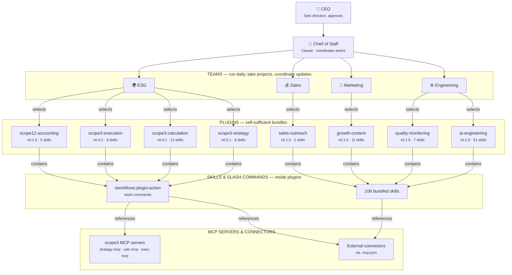

# plugins

Bundle of 8 Claude Code plugins orchestrated as an **agency**. A CEO (you) sets direction, a **Chief of Staff** (Claude) coordinates teams, and teams run daily for hours — picking up projects, executing workflows, and pushing updates through their plugin stacks.

Each plugin is **self-sufficient** — skills, commands, agents, and MCP configs are bundled locally.

Quick navigation:
- `PLUGIN_REGISTRY.md` (demo/story index)
- `teams/teams.json` (example team composition map)

## Org Architecture

```
CEO (You)
 └─ Chief of Staff (Claude)
     ├─ Engineering Team   → ai-engineering, quality-monitoring
     ├─ Marketing Team     → growth-content
     ├─ Sales Team         → sales-outreach
     └─ ESG Team           → scope3-strategy, scope3-calculation, scope3-execution, scope12-accounting
```



### Dependency Flow

```
CEO → Chief of Staff → Team → selects → Plugin → contains → Skills + /Commands → references → MCP servers/connectors
```

| Layer | What | How it works |
|-------|------|--------------|
| **CEO** | You — sets direction, approves major decisions | Teams escalate blockers and approvals here |
| **Chief of Staff** | Claude — coordinates all teams | Spawns teams, assigns projects, reviews output, runs daily |
| **Teams** | Run daily for hours, take projects, coordinate updates | Each team sees only its plugins + shared connectors |
| **Plugins** | Self-sufficient bundles (plugin.json, agents, commands, skills) | Each plugin owns its skill files locally |
| **Skills & Commands** | SKILL.md knowledge packs + `/workflows:*` slash commands | Skills share the plugin's MCP scope |
| **MCP** | JSON-RPC 2.0 servers (scope3) + external connectors (.mcp.json) | Scoped per-plugin via `.mcp.json` |

---

## Included Plugins

### ESG / Carbon Domain (Tier 1)

| Plugin | Version | Skills | Agents | Commands | MCP | Hooks |
|--------|---------|--------|--------|----------|-----|-------|
| `scope3-strategy` | 0.5.1 | 7 | 7 | 7 dirs | strategy-mcp.js | hooks.json |
| `scope3-calculation` | 0.4.1 | 12 | 7 | 9 dirs | calc-mcp.js | hooks.json |
| `scope3-execution` | 0.4.1 | 8 | 6 | 9 | exec-mcp.js | hooks.json |
| `scope12-accounting` | 0.1.0 | 4 | 5 | 4 dirs | .mcp.json | — |

### General Purpose (Tier 2–3)

| Plugin | Version | Skills | Agents | Commands | MCP | Hooks |
|--------|---------|--------|--------|----------|-----|-------|
| `ai-engineering` | 0.1.0 | 50 | 1 | 3 | .mcp.json | — |
| `growth-content` | 0.1.0 | 10 | 1 | 3 | .mcp.json | — |
| `quality-monitoring` | 0.1.0 | 6 | 1 | 4 | .mcp.json | — |
| `sales-outreach` | 0.1.0 | 1 | 1 | 3 | .mcp.json | — |

---

## Skill Mapping (67 skills across 4 plugins)

### ai-engineering (50 skills)

| Category | Skills |
|----------|--------|
| **Training** | accelerate, axolotl, deepspeed, flash-attention, llama-factory, megatron, peft, ray-train, torchtitan, trl, unsloth |
| **Serving** | llama-cpp, sglang, tensorrt-llm, vllm |
| **Quantization** | awq, bitsandbytes, gguf, gptq |
| **RAG / Vector** | chroma, faiss, llamaindex, pinecone, qdrant, sentence-transformers |
| **Vision / Audio** | audiocraft, blip-2, clip, gemini-imagegen, llava, segment-anything, stable-diffusion, whisper |
| **Agent Frameworks** | agent-browser, agent-engineering-workflows, autogpt, crewai, dspy, langchain |
| **3D / Creative** | threejs-fundamentals, threejs-geometry, threejs-interaction, threejs-postprocessing, threejs-shaders, remotion-best-practices |
| **Utility** | brainstorming, find-skills, frontend-design, rclone, skill-installer |

### growth-content (10 skills)

| Category | Skills |
|----------|--------|
| **Strategy & Positioning** | content-positioning-strategy, product-marketing-context, free-tool-strategy |
| **SEO & Schema** | seo-programmatic-audit, schema-markup |
| **Campaigns & Ads** | paid-social-campaigns, email-sequence, ab-test-setup |
| **Analytics & CRO** | analytics-tracking, growth-cro-funnel |

### quality-monitoring (6 skills)

| Category | Skills |
|----------|--------|
| **Evaluation & Benchmarking** | lm-eval, bigcode-eval |
| **Observability & Tracking** | langsmith, phoenix, wandb, mlflow |

### sales-outreach (1 skill)

| Category | Skills |
|----------|--------|
| **Voice Qualification** | retell-calls |

### Domain plugins (scope3-*, scope12-*)

Domain plugins contain their own internal skills (not from the shared skills pool):
- **scope3-strategy** (7): ai-external-risk-scanning, csrd-dma-precollection-guidance, dma-audit-materiality-matrix, dma-stage1-lifecycle, esrs-sequencing, export-evidence-pack, regulatory-evidence-linkage
- **scope3-calculation** (12): calculation-traceability, compute-method-hierarchy, deep-tech-lca-physics, dqs-traceability, factor-mapping, finance-carbon-ledger-rigor, hotspots-campaigns, ingest-client-server, ingest-normalization, overrides-adjustments-governance, replay-consistency, spend-rapid-baseline
- **scope3-execution** (8): disclosure-screenshot-intel, ocr-provenance, pipeline-execution, quality-rate-limit-audit, reduce-measure-report, report-control-pack, supplier-maturity-scorecards, tier2-survey-cascade
- **scope12-accounting** (4): kpi-normalization-rules, reporting-assurance-rules, scope1-method-rules, scope2-method-rules

---

## Plugin Layout

```
<plugin>/
├── .claude-plugin/
│   └── plugin.json          # name, version, description, entrypoints
├── agents/
│   └── *.md                 # YAML frontmatter: name, description
├── commands/
│   └── *.md                 # YAML frontmatter: name, description, allowed-tools
├── skills/
│   ├── <plugin-name>/
│   │   └── SKILL.md         # Main skill manifest (lists all bundled skills)
│   ├── <skill-a>/
│   │   └── SKILL.md         # Individual skill knowledge pack
│   └── <skill-b>/
│       └── SKILL.md
├── .mcp.json                # MCP server/connector config (optional)
├── hooks/
│   └── hooks.json           # Pre/post command hooks (scope3 only)
└── tools/
    └── *-mcp.js             # MCP server implementation (scope3 only)
```

Each plugin is **self-sufficient** — all skills are bundled locally inside the plugin's `skills/` directory. No external path references.

---

## Slash Commands

### ai-engineering
- `/workflows:ai-engineering:train-or-finetune-stack`
- `/workflows:ai-engineering:run-serving-benchmark`
- `/workflows:ai-engineering:build-rag-stack`

### growth-content
- `/workflows:growth-content:content-brief`
- `/workflows:growth-content:campaign-audit`
- `/workflows:growth-content:meme-ideation-batch`

### quality-monitoring
- `/workflows:quality-monitoring:run-quality-gates`
- `/workflows:quality-monitoring:run-visual-quality-monitoring`
- `/workflows:quality-monitoring:request-human-approval`
- `/workflows:quality-monitoring:record-memory`

### sales-outreach
- `/workflows:sales-outreach:run-daily-revenue-cycle`
- `/workflows:sales-outreach:prepare-approval-batch`
- `/workflows:sales-outreach:launch-voice-qualification`

### scope3-strategy
- `/workflows:scope3-strategy:csrd-*` (7 command groups)

### scope3-calculation
- `/workflows:scope3-calculation:ingest-*`, `baseline-*`, `compute-*`, etc. (9 command groups)

### scope3-execution
- `/workflows:scope3-execution:run-execution-pipeline`
- `/workflows:scope3-execution:disclosure-screenshot-intel`
- `/workflows:scope3-execution:supplier-maturity-scorecards`
- `/workflows:scope3-execution:cascade-tier2-surveys`
- + 5 more

### scope12-accounting
- `/workflows:scope12-accounting:compute-*`, `governance-*`, `kpi-*`, `reporting-*` (4 command groups)

---

## Setup

### Prerequisites

- Node.js 18+
- Python 3.10+
- `jq` (used by quality-monitoring scripts)
- Optional: Playwright (for visual test suites)

### 1. Clone and verify structure

```bash
# Each plugin should have .claude-plugin/plugin.json
for d in */; do
  if [ -f "$d.claude-plugin/plugin.json" ]; then
    echo "OK: $d"
  else
    echo "MISSING: $d"
  fi
done
```

### 2. Configure environment variables

Create a local env file:

```bash
cp .env.plugins.example .env.plugins.local
```

Required keys by plugin:

| Plugin | Required Env Vars |
|--------|-------------------|
| `ai-engineering` | `OPENAI_API_KEY`, `ANTHROPIC_API_KEY`, `HF_TOKEN`, `WANDB_API_KEY`, `LANGSMITH_API_KEY`, `PINECONE_API_KEY`, `MLFLOW_TRACKING_URI`, `GOOGLE_API_KEY` |
| `growth-content` | `GOOGLE_API_KEY` / `GEMINI_API_KEY`, `DEEPGRAM_API_KEY`, `ZAPIER_MCP_API_KEY` |
| `quality-monitoring` | (uses ai-engineering keys for eval skills) |
| `sales-outreach` | `RETELL_API_KEY`, `RETELL_FROM_NUMBER`, `RETELL_AGENT_ID`, `HUNTER_API_KEY`, `APOLLO_API_KEY`, `GMAIL_CREDENTIALS_PATH` |
| `scope3-*` | No external keys (self-contained MCP servers) |
| `scope12-accounting` | No external keys |

Load into your shell:

```bash
set -a && source .env.plugins.local && set +a
```

### 3. Validate the bundle

```bash
python3 scripts/validate_bundle.py --mcp-selftest
```

### 4. Test MCP servers (scope3 plugins)

```bash
# Each scope3 plugin has a tools/*-mcp.js that speaks JSON-RPC 2.0 over stdio
echo '{"jsonrpc":"2.0","id":1,"method":"initialize","params":{"protocolVersion":"2024-11-05"}}' | \
  node scope3-calculation/tools/calc-mcp.js
```

### 5. Compose teams

Teams are logical groupings of plugins. Example team compositions:

```
Engineering Team:  ai-engineering + quality-monitoring
Marketing Team:    growth-content
Sales Team:        sales-outreach
ESG Team:          scope3-strategy + scope3-calculation + scope3-execution + scope12-accounting
```

Use Claude Code's team features to orchestrate multi-plugin workflows with parallel agent swarms.

---

## Architecture Notes

- **MCP Servers** (scope3 family): Zero-dependency Node.js, LSP-style `Content-Length` framing + JSON-RPC 2.0. Each exposes `*.health` and `*.sha256` tools.
- **Hooks** (scope3 family): Declared in `hooks/hooks.json` with `preCommand` and `postCommand` arrays. Currently declaration-only (no runtime scripts).
- **Plugin.json schema**: scope3 uses flat keys (`"commands": "commands"`), scope12/general use nested `"entrypoints"` or `*Path` suffixed keys. Both patterns work.
- **Skill self-sufficiency**: Every skill referenced by a plugin exists as a local `skills/<name>/SKILL.md` inside that plugin. No external path dependencies.
